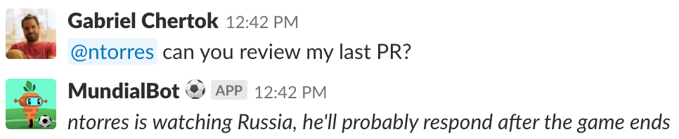

# MundialBot⚽️

MundialBot⚽️ is a Slack bot for distributed teams watching the WorldCup

## What problem does it solve?

You know that moment when somebody mentions you on Slack and you are watching your team playing at the WorldCup, you try keep watching the game while answering with your phone just to drop your phone and miss an important play.

MundialBot⚽️ solves it by looking at your timezone to guess your country and looks if your national team is playing, if so it automatically answers the mention with something similar to this:

> _@cherta is watching Uruguay, he'll probably respond after the game ends._

